# GitHub Auto-Deploy Setup Guide

Complete guide to set up automatic deployment from GitHub to Oracle Cloud Infrastructure.

---

## 🎯 Overview

When you push code to the `main` branch, GitHub Actions will automatically:
1. ✅ Run tests and linting
2. ✅ Build Docker image
3. ✅ Push image to container registry (optional)
4. ✅ Deploy to Oracle Cloud server
5. ✅ Run database migrations
6. ✅ Verify deployment health
7. ✅ Rollback on failure

---

## 📋 Prerequisites Checklist

Before setting up auto-deploy, ensure you have:

- [ ] Oracle Cloud compute instance running
- [ ] Application deployed manually at least once (follow PRODUCTION_SETUP_GUIDE.md)
- [ ] SSH access to the server
- [ ] GitHub repository with code pushed
- [ ] GitHub account with admin access to repository

---

## 🚀 Quick Setup (3 Deployment Options)

### **Option 1: Direct Deployment (Recommended - Simplest)**
Deploy code directly from GitHub to server without Docker registry.

### **Option 2: Docker Registry Deployment**
Build Docker image, push to OCI Container Registry, then deploy.

### **Option 3: GitHub Container Registry**
Use GitHub's free container registry (ghcr.io).

---

## Option 1: Direct Deployment Setup (Recommended)

This is the simplest option - no container registry needed!

### Step 1: Prepare Your Oracle Cloud Server

SSH to your server and ensure the app is set up:

```bash
# SSH to server
ssh -i ~/.ssh/your-key.pem opc@<YOUR_SERVER_IP>

# Verify application directory exists
ls -la /opt/jobtracker

# Ensure Docker and Docker Compose are installed
docker --version
docker-compose --version

# Ensure your user can run Docker without sudo
sudo usermod -aG docker opc
newgrp docker

# Test Docker access
docker ps
```

### Step 2: Create Deployment SSH Key

Create a dedicated SSH key for GitHub Actions:

```bash
# On your local machine
ssh-keygen -t ed25519 -C "github-actions-deploy" -f ~/.ssh/github_deploy_key

# Don't set a passphrase (press Enter twice)

# Copy public key to your server
ssh-copy-id -i ~/.ssh/github_deploy_key.pub opc@<YOUR_SERVER_IP>

# Test the key works
ssh -i ~/.ssh/github_deploy_key opc@<YOUR_SERVER_IP> "echo 'SSH key works!'"

# Copy the PRIVATE key content (you'll need this for GitHub)
cat ~/.ssh/github_deploy_key
```

### Step 3: Configure GitHub Secrets

1. **Go to your GitHub repository**
2. **Navigate to**: Settings → Secrets and variables → Actions
3. **Click**: "New repository secret"

Add these secrets one by one:

#### Required Secrets:

**OCI_HOST**
```
Value: <YOUR_SERVER_PUBLIC_IP>
Example: 129.80.123.45
```

**OCI_USER**
```
Value: opc
(or ubuntu if you're using Ubuntu)
```

**OCI_SSH_PRIVATE_KEY**
```
Value: <Paste the ENTIRE content from cat ~/.ssh/github_deploy_key>
Including the -----BEGIN and -----END lines
```

**PRODUCTION_URL**
```
Value: <YOUR_DOMAIN_OR_IP>
Example: jobtracker.example.com
Or: 129.80.123.45
```

#### Optional Secrets (for Docker registry - skip for now):

**OCI_REGISTRY** - Skip for Option 1
**OCI_NAMESPACE** - Skip for Option 1
**OCI_USERNAME** - Skip for Option 1
**OCI_AUTH_TOKEN** - Skip for Option 1

### Step 4: Update GitHub Workflow for Direct Deployment

Create a simplified deployment workflow:

```bash
# Edit the deploy workflow
nano .github/workflows/deploy.yml
```

Replace with this simplified version:

```yaml
name: Deploy to Oracle Cloud

on:
  push:
    branches:
      - main
  workflow_dispatch:  # Allows manual trigger

jobs:
  test:
    name: Run Tests
    runs-on: ubuntu-latest

    steps:
      - name: Checkout code
        uses: actions/checkout@v4

      - name: Setup Node.js
        uses: actions/setup-node@v4
        with:
          node-version: '18'
          cache: 'npm'

      - name: Install dependencies
        run: npm ci

      - name: Run linting
        run: npm run lint || echo "⚠️ No lint script configured"

      - name: Run tests
        run: npm test || echo "⚠️ No tests configured"

  deploy:
    name: Deploy to OCI
    runs-on: ubuntu-latest
    needs: test
    if: github.ref == 'refs/heads/main'

    steps:
      - name: Checkout code
        uses: actions/checkout@v4

      - name: Setup SSH
        uses: webfactory/ssh-agent@v0.8.0
        with:
          ssh-private-key: ${{ secrets.OCI_SSH_PRIVATE_KEY }}

      - name: Add server to known hosts
        run: |
          mkdir -p ~/.ssh
          ssh-keyscan -H ${{ secrets.OCI_HOST }} >> ~/.ssh/known_hosts

      - name: Deploy to Server
        env:
          OCI_HOST: ${{ secrets.OCI_HOST }}
          OCI_USER: ${{ secrets.OCI_USER }}
        run: |
          ssh ${{ env.OCI_USER }}@${{ env.OCI_HOST }} << 'ENDSSH'
            set -e

            echo "🚀 Starting deployment..."

            # Navigate to application directory
            cd /opt/jobtracker

            # Backup current state
            echo "📦 Creating backup..."
            docker-compose exec -T postgres pg_dump -U jobtracker_user huntr_clone > /tmp/pre_deploy_backup.sql 2>/dev/null || echo "No existing database to backup"

            # Pull latest code
            echo "📥 Pulling latest code from GitHub..."
            git fetch origin main
            git reset --hard origin/main

            # Install/update dependencies
            echo "📦 Updating dependencies..."
            npm ci --only=production
            cd client && npm ci --only=production && cd ..

            # Build frontend
            echo "🔨 Building frontend..."
            cd client && npm run build && cd ..

            # Generate Prisma client
            echo "🔧 Generating Prisma client..."
            npx prisma generate

            # Run database migrations
            echo "🗄️ Running database migrations..."
            npx prisma migrate deploy

            # Restart application
            echo "♻️ Restarting application..."
            docker-compose restart app

            # Wait for health check
            echo "🏥 Checking application health..."
            sleep 10

            MAX_RETRIES=5
            RETRY_COUNT=0

            while [ $RETRY_COUNT -lt $MAX_RETRIES ]; do
              if curl -f http://localhost:3000/health > /dev/null 2>&1; then
                echo "✅ Application is healthy!"
                break
              else
                RETRY_COUNT=$((RETRY_COUNT + 1))
                echo "⏳ Waiting for application... ($RETRY_COUNT/$MAX_RETRIES)"
                sleep 5
              fi
            done

            if [ $RETRY_COUNT -eq $MAX_RETRIES ]; then
              echo "❌ Health check failed!"
              echo "🔄 Rolling back..."
              git reset --hard HEAD~1
              docker-compose restart app
              exit 1
            fi

            # Cleanup
            echo "🧹 Cleaning up..."
            docker system prune -f
            rm -f /tmp/pre_deploy_backup.sql

            echo "✅ Deployment completed successfully!"
          ENDSSH

      - name: Verify Deployment
        run: |
          echo "🔍 Verifying external access..."
          sleep 5
          if curl -f http://${{ secrets.OCI_HOST }}:3000/health; then
            echo "✅ External health check passed!"
          else
            echo "⚠️ External health check failed (might be firewall/nginx)"
          fi

      - name: Deployment Summary
        if: success()
        run: |
          echo "━━━━━━━━━━━━━━━━━━━━━━━━━━━━━━━━━━━━━━━━"
          echo "✅ DEPLOYMENT SUCCESSFUL!"
          echo "━━━━━━━━━━━━━━━━━━━━━━━━━━━━━━━━━━━━━━━━"
          echo "🌐 Application URL: http://${{ secrets.PRODUCTION_URL }}"
          echo "📊 Commit: ${{ github.sha }}"
          echo "👤 Deployed by: ${{ github.actor }}"
          echo "━━━━━━━━━━━━━━━━━━━━━━━━━━━━━━━━━━━━━━━━"
```

### Step 5: Setup Git on Your Server

SSH to server and configure Git:

```bash
ssh opc@<YOUR_SERVER_IP>

cd /opt/jobtracker

# Initialize git if not already done
git init

# Add your GitHub repository as remote
git remote add origin https://github.com/Nakeerans/claudeproject.git

# Or if using SSH
git remote add origin git@github.com:Nakeerans/claudeproject.git

# Fetch the code
git fetch origin main

# Set up tracking
git branch --set-upstream-to=origin/main main

# Pull initial code
git pull origin main

# Verify
git status
```

### Step 6: Test Auto-Deployment

1. **Make a small change locally:**

```bash
# On your local machine
cd /Users/nakeeransaravanan/Devops_practise/claudeproject

# Make a small change (e.g., add a comment)
echo "// Test deployment" >> src/server/index.js

# Commit and push
git add .
git commit -m "Test: Trigger auto-deployment"
git push claude main
```

2. **Watch the deployment:**
   - Go to: https://github.com/Nakeerans/claudeproject/actions
   - You should see your workflow running
   - Click on it to watch the live logs

3. **Verify deployment:**
   - Check if the deployment succeeded
   - Visit your application URL
   - Check the health endpoint

---

## Option 2: Docker Registry Deployment

If you prefer using Docker registry (more production-grade):

### Additional Secrets Needed:

**OCI_REGISTRY**
```
Value: <region-key>.ocir.io
Example: phx.ocir.io (Phoenix)
         iad.ocir.io (Ashburn)
         fra.ocir.io (Frankfurt)
```

**OCI_NAMESPACE**
```
Value: <your-tenancy-namespace>
Find it: OCI Console → User (top right) → Tenancy: <namespace>
```

**OCI_USERNAME**
```
Value: <tenancy-namespace>/<your-email>
Example: mytenancy/user@email.com
```

**OCI_AUTH_TOKEN**
```
Generate: OCI Console → User Settings → Auth Tokens → Generate Token
Copy the token immediately (shown only once!)
```

### Use the original deploy.yml workflow (already created)

The existing `.github/workflows/deploy.yml` file supports this option.

---

## Option 3: GitHub Container Registry (Free!)

Use GitHub's free container registry instead of OCI.

### Update Secrets:

Replace OCI secrets with:

**GHCR_TOKEN**
```
Value: <Your GitHub Personal Access Token>
Generate: GitHub → Settings → Developer Settings → Personal Access Tokens
Scopes needed: write:packages, read:packages
```

### Update deploy.yml:

Change registry to GitHub:

```yaml
- name: Login to GitHub Container Registry
  uses: docker/login-action@v3
  with:
    registry: ghcr.io
    username: ${{ github.actor }}
    password: ${{ secrets.GHCR_TOKEN }}

- name: Build and push Docker image
  uses: docker/build-push-action@v5
  with:
    context: .
    push: true
    tags: |
      ghcr.io/${{ github.repository }}:${{ github.sha }}
      ghcr.io/${{ github.repository }}:latest
```

---

## 🔧 Troubleshooting

### Deployment fails with "Permission denied (publickey)"

**Solution:**
```bash
# Verify SSH key is correct
cat ~/.ssh/github_deploy_key

# Ensure it's added to GitHub secrets correctly
# Test SSH from your local machine:
ssh -i ~/.ssh/github_deploy_key opc@<YOUR_SERVER_IP>
```

### Deployment fails at "git pull"

**Solution:**
```bash
# SSH to server
ssh opc@<YOUR_SERVER_IP>

# Check git status
cd /opt/jobtracker
git status

# If there are local changes, stash them
git stash

# Configure git to allow pulls
git config pull.rebase false

# Set up GitHub authentication
# For HTTPS:
git config credential.helper store

# For SSH:
ssh-keygen -t ed25519 -f ~/.ssh/id_ed25519
# Add public key to GitHub: Settings → SSH Keys
```

### Health check fails

**Solution:**
```bash
# Check application logs
docker-compose logs app

# Check if port is accessible
curl http://localhost:3000/health

# Restart manually
docker-compose restart app
```

### Database migration fails

**Solution:**
```bash
# Check Prisma schema
npx prisma validate

# Run migrations manually
npx prisma migrate deploy

# Check database connection
docker-compose exec postgres psql -U jobtracker_user -d huntr_clone
```

---

## 📊 Monitoring Deployments

### View Deployment History
- GitHub → Repository → Actions
- Click on any workflow run to see details

### Enable Notifications
- GitHub → Repository → Settings → Notifications
- Enable email notifications for workflow failures

### Deployment Logs
```bash
# SSH to server
ssh opc@<YOUR_SERVER_IP>

# View application logs
cd /opt/jobtracker
docker-compose logs -f app

# View deployment history
git log --oneline -10
```

---

## 🎯 Best Practices

### 1. Use Branch Protection
- Settings → Branches → Add rule for `main`
- Require pull request reviews
- Require status checks to pass

### 2. Use Staging Environment
Create a `develop` branch for testing:

```yaml
on:
  push:
    branches:
      - main      # Production
      - develop   # Staging
```

### 3. Add Deployment Approval
For production, require manual approval:

```yaml
deploy:
  environment:
    name: production
    url: https://yourapp.com
  # This requires manual approval in GitHub
```

### 4. Backup Before Deploy
Already included in the workflow above!

### 5. Monitor Deployments
- Set up monitoring (DataDog, New Relic, etc.)
- Configure alerts for deployment failures
- Review logs after each deployment

---

## 🚦 Deployment Workflow

```mermaid
graph LR
    A[Push to main] --> B[Run Tests]
    B --> C[Build Frontend]
    C --> D[Deploy to Server]
    D --> E[Run Migrations]
    E --> F[Restart App]
    F --> G[Health Check]
    G --> H{Healthy?}
    H -->|Yes| I[✅ Success]
    H -->|No| J[❌ Rollback]
```



---

## 📝 Deployment Checklist

Before first auto-deployment:
- [ ] Server is running and accessible
- [ ] Application deployed manually once
- [ ] SSH key created and added to server
- [ ] GitHub secrets configured
- [ ] Git configured on server
- [ ] Docker and Docker Compose installed
- [ ] Database initialized
- [ ] Firewall configured
- [ ] .env file configured on server

After setup:
- [ ] Test deployment with small change
- [ ] Verify health check passes
- [ ] Check application is accessible
- [ ] Review deployment logs
- [ ] Test rollback (optional)

---

## 🎉 You're All Set!

Once configured, every push to `main` will:
1. Automatically run tests
2. Deploy to your Oracle Cloud server
3. Run database migrations
4. Restart the application
5. Verify it's healthy
6. Rollback if anything fails

**Next Steps:**
1. Push code to trigger first deployment
2. Monitor in GitHub Actions
3. Verify on your server
4. Celebrate! 🎊

---

## 📞 Need Help?

- **GitHub Actions Docs**: https://docs.github.com/en/actions
- **Workflow Logs**: Check GitHub Actions tab in your repository
- **Server Logs**: `docker-compose logs -f app`
- **Health Check**: `curl http://localhost:3000/health`

---

## Quick Reference

```bash
# Trigger manual deployment
# GitHub → Actions → Deploy to Oracle Cloud → Run workflow

# View deployment logs
ssh opc@<SERVER> "cd /opt/jobtracker && docker-compose logs -f app"

# Check deployment status
curl http://<SERVER-IP>:3000/health

# Rollback manually
ssh opc@<SERVER> "cd /opt/jobtracker && git reset --hard HEAD~1 && docker-compose restart app"
```
